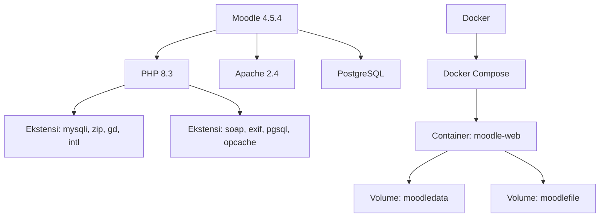
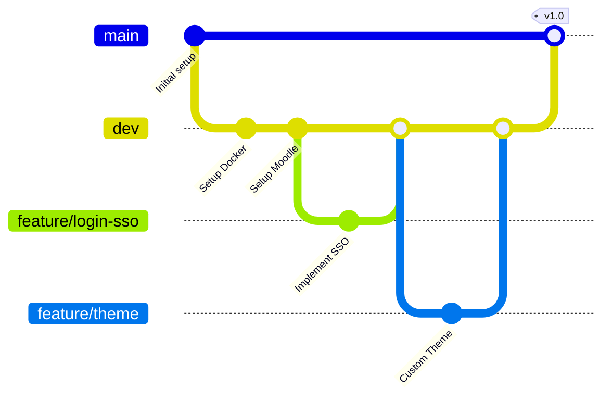

# 🚀 Petrokimia Gresik Learning Management System

<div align="center">
  
  <h2>⚡ learn.petrokimia-gresik.com ⚡</h2>
  <p><strong>Platform E-Learning Terintegrasi | Moodle 4.5.4</strong></p>
  
  
  
  
  
</div>

## 📋 Daftar Isi

- [Tentang Proyek](#-tentang-proyek)
- [Tech Stack](#-tech-stack)
- [Lingkungan Pengembangan](#-lingkungan-pengembangan)
- [Quick Start](#-quick-start)
- [Deployment ke Produksi](#-deployment-ke-produksi)
- [Struktur Project](#-struktur-project)
- [Konfigurasi Lanjutan](#-konfigurasi-lanjutan)
- [Plugin Rekomendasi](#-plugin-rekomendasi)
- [Workflow Pengembangan](#-workflow-pengembangan)
- [Monitoring & Maintenance](#-monitoring--maintenance)
- [Troubleshooting](#-troubleshooting)
- [FAQ](#-faq)
- [Kontributor](#-kontributor)

## 🔍 Tentang Proyek

> **VISI**: Menciptakan ekosistem pembelajaran digital terpadu untuk meningkatkan kompetensi SDM Petrokimia Gresik

LMS ini dikembangkan untuk:

- 📚 Mengelola materi pelatihan internal & eksternal
- 📊 Melacak progres pembelajaran karyawan & magang
- 🤝 Kolaborasi dengan vendor penyedia konten pelatihan
- 📝 Evaluasi hasil pembelajaran melalui post-test
- 🏆 Sertifikasi pencapaian pembelajaran

## 💻 Tech Stack



## 🛠 Lingkungan Pengembangan

### Prasyarat

| Software | Versi Minimum | Keterangan |
|----------|---------------|------------|
| Docker   | 20.10.x       | [Download](https://docs.docker.com/get-docker/) |
| Docker Compose | 2.x    | Termasuk dalam Docker Desktop |
| Git      | 2.x          | [Download](https://git-scm.com/downloads) |
| RAM      | 4GB          | Rekomendasi: 8GB |
| Storage  | 10GB         | Rekomendasi: 20GB |

## 🚀 Quick Start

### Clone Repository & Setup

```bash
# Clone repository
git clone https://github.com/tekinfopg/learn.git
cd learn

# Setup environment
cp .env.example .env
```

> ⚠️ **PERHATIAN**: File `.env` mengandung variabel sensitif. Jangan pernah commit file ini ke repo!

### Build & Run

```bash
# Development
docker-compose up -d

# Lihat logs
docker-compose logs -f

# Buka shell di container
docker exec -it moodle-web bash
```

### Akses Aplikasi

Setelah container berjalan:
- 🌐 URL Lokal: http://localhost:2080
- 👤 Admin default: admin / moodle

## 🌍 Deployment ke Produksi

### 1. Persiapan Server

```bash
# Update server
apt update && apt upgrade -y

# Install Docker & Docker Compose
curl -fsSL https://get.docker.com | sh
```

### 2. Konfigurasi Production

Buat file `.env.prod`:

```ini
MOODLE_PORT=80
# Konfigurasi tambahan untuk production
```

### 3. Deploy ke Production

```bash
# Clone repo di server production
git clone https://github.com/tekinfopg/learn.git
cd learn

# Gunakan konfigurasi production
cp .env.prod .env

# Deploy dengan Docker Compose
docker-compose up -d --build
```

### 4. Setup SSL dengan Traefik (Opsional)

```yaml
# Tambahkan ke docker-compose.yml
services:
  traefik:
    image: traefik:v2.9
    # Konfigurasi lainnya...
    
  moodleapp:
    # Tambahkan labels Traefik
    labels:
      - "traefik.enable=true"
      - "traefik.http.routers.moodle.rule=Host(`learn.petrokimia-gresik.com`)"
      - "traefik.http.routers.moodle.tls.certresolver=letsencrypt"
```

### 5. Backup Otomatis

Buat script backup:

```bash
#!/bin/bash
# /opt/scripts/backup-moodle.sh

BACKUP_DIR="/backup/moodle/$(date +%Y-%m-%d)"
mkdir -p $BACKUP_DIR

# Backup volumes
docker run --rm -v moodledata:/source -v $BACKUP_DIR:/backup alpine tar czf /backup/moodledata.tar.gz -C /source .
docker run --rm -v moodlefile:/source -v $BACKUP_DIR:/backup alpine tar czf /backup/moodlefile.tar.gz -C /source .

# Backup database
docker exec postgresql pg_dump -U moodle moodle > $BACKUP_DIR/moodle_db.sql

# Rotate backups (simpan 7 hari terakhir)
find /backup/moodle -type d -mtime +7 -exec rm -rf {} \;
```

## 📂 Struktur Project

```
learn/
├── .env                 # Environment variables (dibuat dari .env.example)
├── .env.example         # Contoh environment variables
├── .gitignore           # File yang diignore oleh Git
├── docker-compose.yml   # Definisi layanan Docker
├── Moodle               # Dockerfile untuk membangun image Moodle
├── custom/              # Kustomisasi tema dan plugin
│   ├── plugins/         # Plugin kustom
│   └── theme/           # Tema kustom PT Petrokimia Gresik
└── scripts/             # Script utilitas
```

## ⚙️ Konfigurasi Lanjutan

### Meningkatkan Performa

Edit file `/usr/local/etc/php/conf.d/docker-php-opcache.ini`:

```ini
opcache.memory_consumption=256
opcache.max_accelerated_files=20000
opcache.revalidate_freq=0  # Untuk production
```

### Menyesuaikan PHP Memory Limit

```bash
docker exec -it moodle-web bash -c "echo 'memory_limit = 512M' >> /usr/local/etc/php/conf.d/docker-php-memlimit.ini"
docker-compose restart moodleapp
```

### Load Testing

Gunakan JMeter atau k6 untuk pengujian beban:

```bash
k6 run --vus 100 --duration 30s loadtest/moodle-test.js
```

## 🧩 Plugin Rekomendasi

| Plugin | Deskripsi | Link |
|--------|-----------|------|
| H5P    | Konten interaktif | [Download](https://moodle.org/plugins/mod_hvp) |
| Attendance | Absensi | [Download](https://moodle.org/plugins/mod_attendance) |
| Certificate | Sertifikat kursus | [Download](https://moodle.org/plugins/mod_certificate) |
| BigBlueButton | Webinar | [Download](https://moodle.org/plugins/mod_bigbluebuttonbn) |

## 🔄 Workflow Pengembangan



### Panduan Branching

- `main` - Production-ready code
- `dev` - Development integration
- `feature/*` - Fitur baru
- `hotfix/*` - Perbaikan bug di production

## 📊 Monitoring & Maintenance

### Health Check

```bash
#!/bin/bash
# health-check.sh

MOODLE_URL="https://learn.petrokimia-gresik.com"
RESPONSE=$(curl -s -o /dev/null -w "%{http_code}" $MOODLE_URL)

if [ $RESPONSE -eq 200 ]; then
    echo "✅ Moodle is running"
else
    echo "❌ Moodle returned $RESPONSE"
    # Send alert to Telegram/Slack
fi
```

### Resource Utilization

Integrasikan dengan Prometheus & Grafana:

```yaml
# prometheus.yml
scrape_configs:
  - job_name: 'moodle'
    static_configs:
      - targets: ['moodle-exporter:9104']
```

## 🔧 Troubleshooting

### Common Issues & Solutions

| Masalah | Solusi |
|---------|--------|
| Moodle tidak dapat mengakses database | `docker-compose restart` |
| Error 500 | Cek log: `docker-compose logs -f moodleapp` |
| Performa lambat | Tingkatkan alokasi resource di Docker |
| Upload file gagal | Cek izin: `docker exec -it moodle-web chown -R www-data:www-data /var/www/moodledata` |

### Debug Mode

Aktifkan debug mode di `config.php`:

```php
$CFG->debug = E_ALL;
$CFG->debugdisplay = 1;
```

## ❓ FAQ

<details>
<summary><b>Bagaimana cara mengubah logo Petrokimia di Moodle?</b></summary>
Masuk sebagai Admin -> Site Administration -> Appearance -> Themes -> Theme Settings
</details>

<details>
<summary><b>Apakah bisa integrasi dengan LDAP/SSO?</b></summary>
Ya, Moodle mendukung LDAP, OAuth2, CAS dan protokol SSO lainnya
</details>

<details>
<summary><b>Berapa kapasitas user yang direkomendasikan?</b></summary>
Dengan konfigurasi server yang baik, Moodle bisa menangani hingga 10.000 user aktif
</details>

## 👥 Kontributor

Tim IT Petrokimia Gresik:
- DevOps: [nama@petrokimia-gresik.com](mailto:nama@petrokimia-gresik.com)
- Backend: [nama@petrokimia-gresik.com](mailto:nama@petrokimia-gresik.com)
- Frontend: [nama@petrokimia-gresik.com](mailto:nama@petrokimia-gresik.com)

---

<div align="center">
  <p><strong>🔒 Dokumen Internal - PT Petrokimia Gresik 🔒</strong></p>
  <p>© 2025 PT Petrokimia Gresik. Hak Cipta Dilindungi.</p>
</div>